

  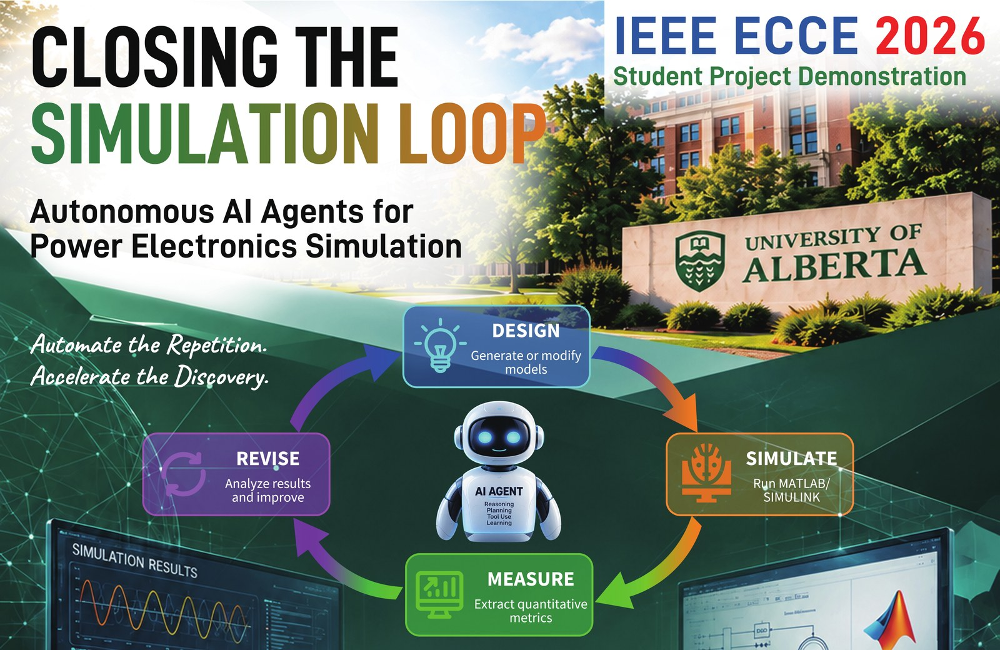

# Closing the Simulation Loop

**Autonomous AI agents for power electronics simulation** · IEEE ECCE 2026 Student Project Demonstration · Vancouver, October 4–8, 2026

ELITE Grid Research Lab, University of Alberta

You scanned the QR code on our poster. This page holds the results behind it: what the agent did, what it measured, and where it fell short.

| | Desktop simulation | Real-time simulation |
| --- | --- | --- |
| **Task given to the agent** | Build and refine an FCS-MPC controller for an induction motor drive | Limit the grid power peak of an AI data center model after a voltage sag |
| **Software the agent operated** | MATLAB / Simulink | MATLAB / Simulink, RT-LAB, OPAL-RT real-time target |
| **Result** | Current THD 14.54 % → 4.75 % in 6 iterations | Recovery peak 485 → 153 kW, 0 overruns at a 50 µs step |
| **Agent working time** | 51.6 min | — |

---

## Agentic AI in two minutes, for power engineers

Most engineers have used a large language model (LLM) as an **advisor**: you describe a problem, it replies with text or code, and then *you* build the model, run it, read the scope, and type the result back. In control terms this is open loop. The model never sees the plant. You are the sensor and the actuator.

An **agent** is the same kind of language model placed inside a feedback loop with real engineering software. It is given tools (open a model, change a block, run a simulation, read a logged signal) and it decides which tool to call next based on what the last call returned.

| LLM as advisor | Agent as experimenter |
| --- | --- |
| 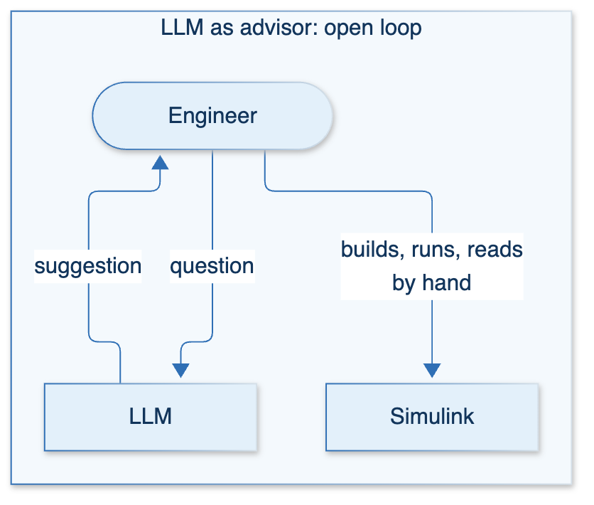 | 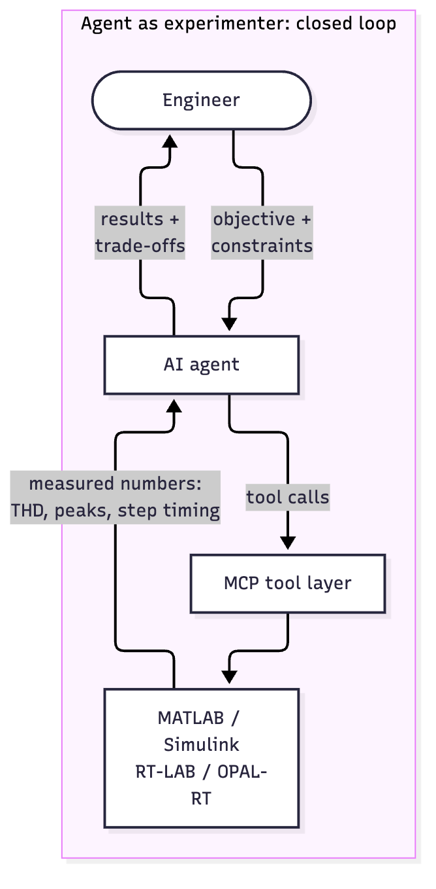 |

Three terms are enough to follow the rest of this page:

- **Tool call.** A structured request from the agent to software, for example "run this model for 2.4 s and return the stator currents". The software does the computation. The agent only reads the answer.
- **MCP (Model Context Protocol).** An open standard for exposing software functions as tools an agent can discover and call. Think of it as the fieldbus between the agent and MATLAB.
- **The loop.** Design → simulate → measure → revise, repeated until the targets are met or the agent reports that they cannot be.

### How this differs from the usual way of using an LLM

| | LLM as advisor | This work |
| --- | --- | --- |
| Who builds and edits the model | The engineer | The agent, through tool calls |
| Who runs the simulation | The engineer | The agent |
| What the AI sees | A description or a screenshot | Logged signals and computed metrics |
| How a design is accepted | It sounds right | It meets a numeric target in a saved run |
| When it fails | Nobody knows until the engineer tries it | The failed run is recorded and drives the next revision |
| Engineer's role | Operator of every step | Sets the objective, answers design questions, reviews the result |

Two points are worth stating plainly, because they are the most common misunderstandings at the booth:

1. **The agent is not the controller.** The FCS-MPC algorithm and the converter control still execute every 25–50 µs inside the simulation. The agent works *between* runs, on a timescale of minutes. It is an outer, supervisory loop around the experiment, not a replacement for the inner control loop.
2. **The agent does not simulate anything itself.** Every waveform on this page was computed by Simulink or by the real-time target. A language model that "predicts" a THD value is guessing; this one reads it from a recording.

## System architecture

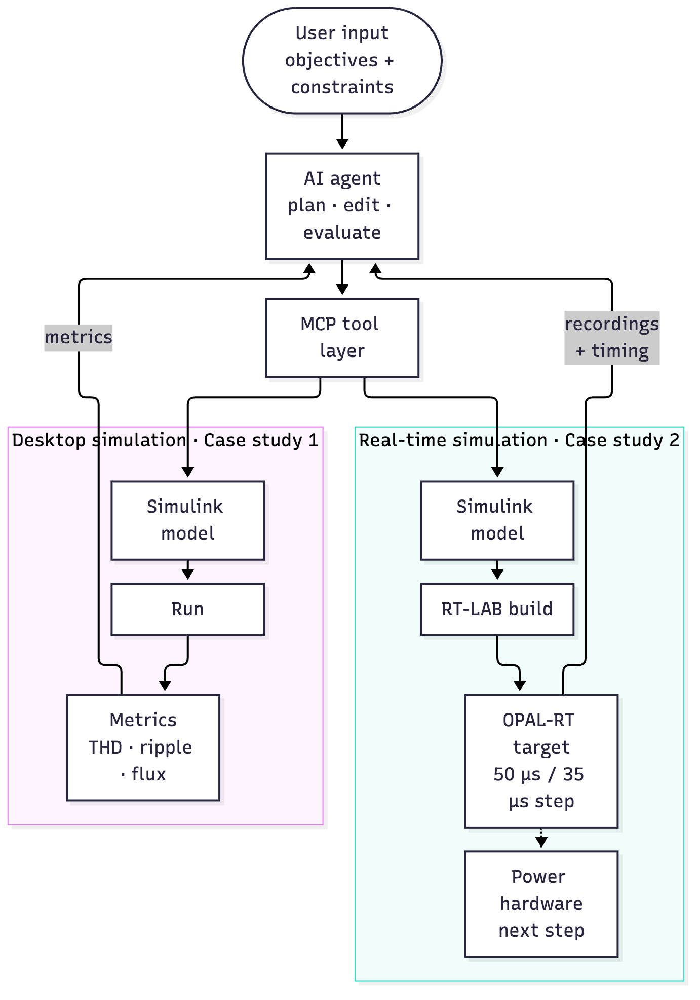

The same loop drives both lanes. On the desktop lane the agent edits and runs a Simulink model. On the real-time lane it also compiles the model, loads it on the simulator, runs it in real time, and reads back the recording together with the target's own timing report.

---

## Case study 1: FCS-MPC for an induction motor drive (desktop)

**Request to the agent:** build and refine a finite-control-set model predictive controller (FCS-MPC) for a 3 hp induction motor drive fed by a two-level inverter. Target: stator current THD at or below 10 %, good tracking, fast dynamic response.

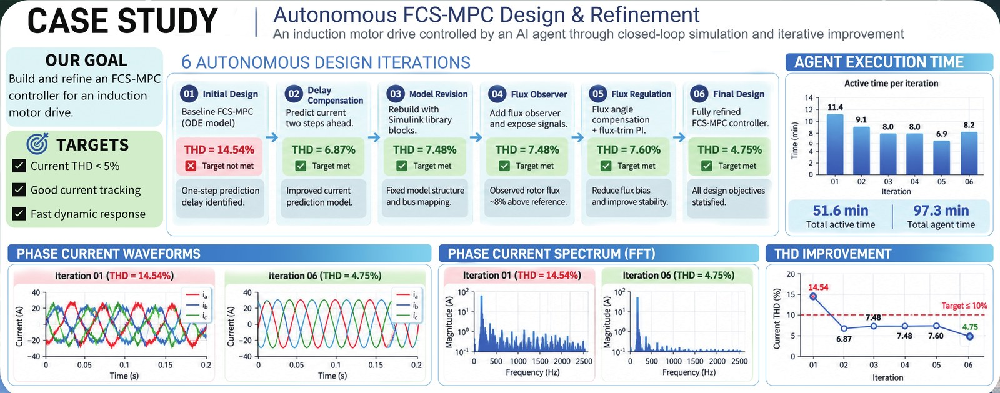

| Iteration | What the agent did | Current THD | Target |
| --- | --- | --- | --- |
| 01 | Baseline FCS-MPC, plant written as equations | 14.54 % | not met |
| 02 | Found the one-step computation delay, predicted two steps ahead | 6.87 % | met |
| 03 | Rebuilt the plant from Simulink library blocks | 7.48 % | met |
| 04 | Added a rotor-flux observer and scopes; found flux about 8 % above reference | 7.48 % | met |
| 05 | Added flux-angle compensation and a slow flux trim | 7.60 % | met |
| 06 | Shorter sample time and cost-function weighting for torque ripple | 4.75 % | met |

Across the six iterations torque ripple fell from 1.62 to 0.31 N·m rms and rotor flux settled on its 0.45 Wb reference. The overall comparison includes controller, plant and sampling changes, so it is a statement about the workflow, not a like-for-like controller benchmark.

**Phase currents at rated load, first and last iteration**

| Iteration 01 (THD 14.54 %) | Iteration 06 (THD 4.75 %) |
| --- | --- |
| 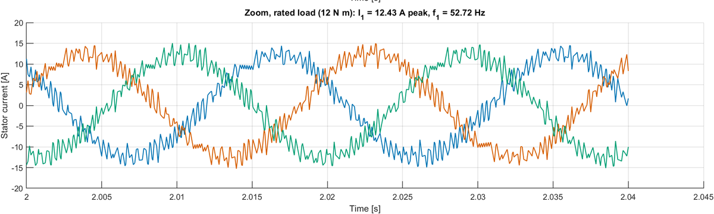 | 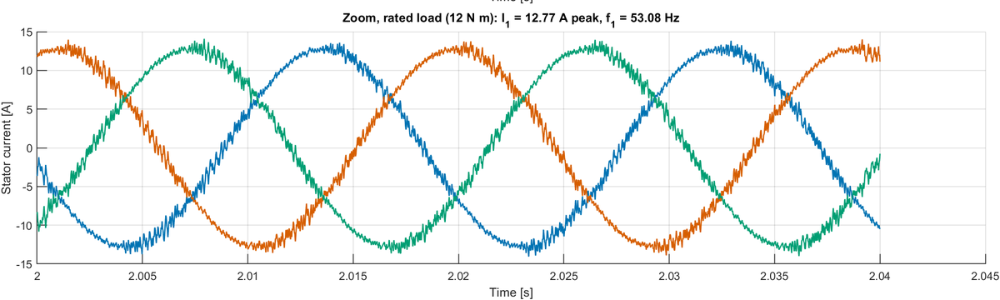 |

Current spectrum of the final design

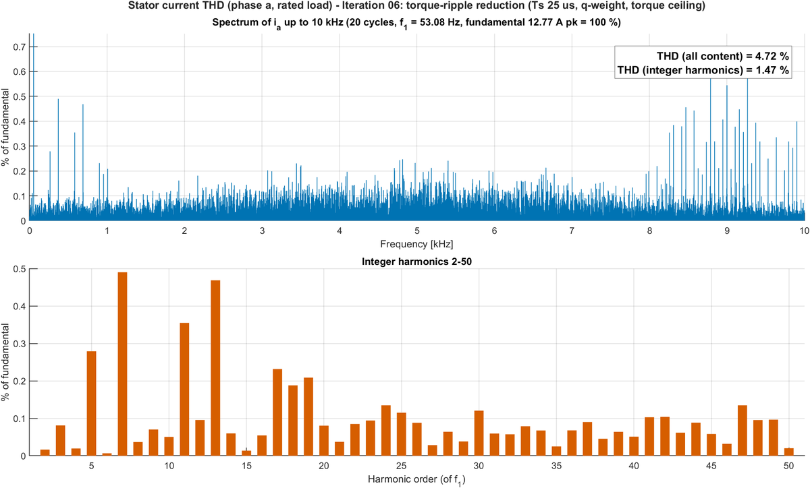

The agent reports THD over all spectral content up to 10 kHz, not only integer harmonics. FCS-MPC has a spread spectrum, so the integer-harmonic figure alone (1.47 %) would flatter the result.

**Where the time went**

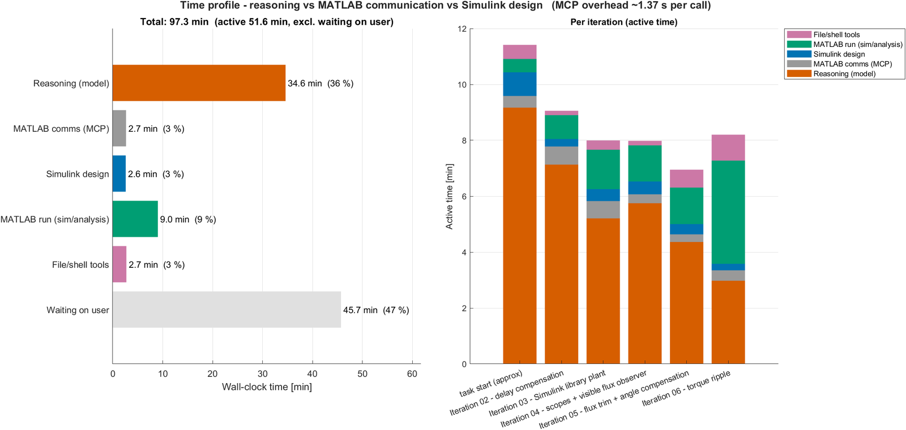

The session lasted 97.3 minutes, of which 51.6 were active agent time. The agent spent most of that reasoning about the next change. Talking to MATLAB took about 3 %. The largest single block, 47 %, was the agent waiting for a person to answer its design questions.

---

## Case study 2: an AI data center model on a real-time simulator

**Request to the agent:** in the lab's AI data center (AIDC) microgrid model, limit the grid power peak that appears when the grid voltage returns after a sag.

This is the step most agent demonstrations do not take. The agent did not stop at a desktop result. It compiled the revised model, loaded it on the lab's OPAL-RT real-time simulator, ran it at a 50 µs step, and read back both the waveforms and the target's timing report.

### Not only Simulink: the agent operates the whole toolchain

A real-time test is normally a manual sequence across several commercial programs: edit the model in Simulink, open the project in RT-LAB, separate and compile it for the target, transfer and load it, start the run, configure the recorder, export the data, then reset the simulator for the next person. The agent carried out that whole sequence itself.

| Software or system | What the agent did there | What came back to the agent |
| --- | --- | --- |
| **MATLAB / Simulink** | Edited the model, ran five desktop cases at the target's step size | Waveforms and pass/fail checks |
| **RT-LAB** (OPAL-RT's real-time software) | Opened the project, generated and compiled the code for the target, transferred and loaded it, set up the recorder, started and stopped the run | Build log, load status, list of recordable signals |
| **OPAL-RT target** (real-time operating system, 50 µs step) | Executed the model in real time | Native recording of 67 channels, live data stream, the target's own overrun and step-time report |
| **Analysis scripts** | Compared the target recording with the desktop run sample by sample | Peak, restart time, DC bus minimum, 0.04 W agreement |
| **RT-LAB again** | Reset the model, restored the settings it had changed, closed the project | Simulator left ready for the next user |

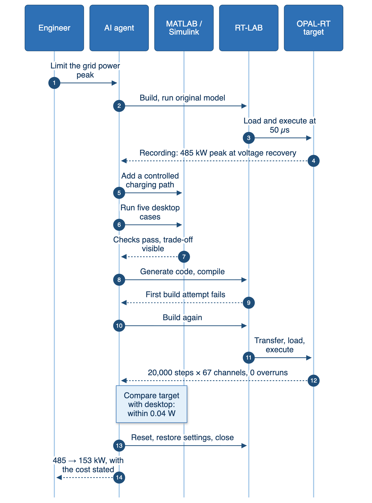

Nothing in this sequence is specific to one vendor. Each program is reached through its own scripting interface, wrapped as tools the agent can call. The same approach extends to other engineering software; we keep a public list of such connectors at [Awesome-MCP-for-Power-Engineering](https://github.com/Yuz2023/Awesome-MCP-for-Power-Engineering).

**The five steps, one page each**

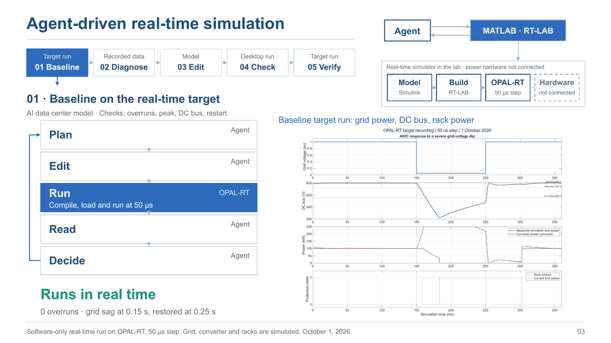

The highlight in the top-right corner of each page shows which software the agent is operating at that step.

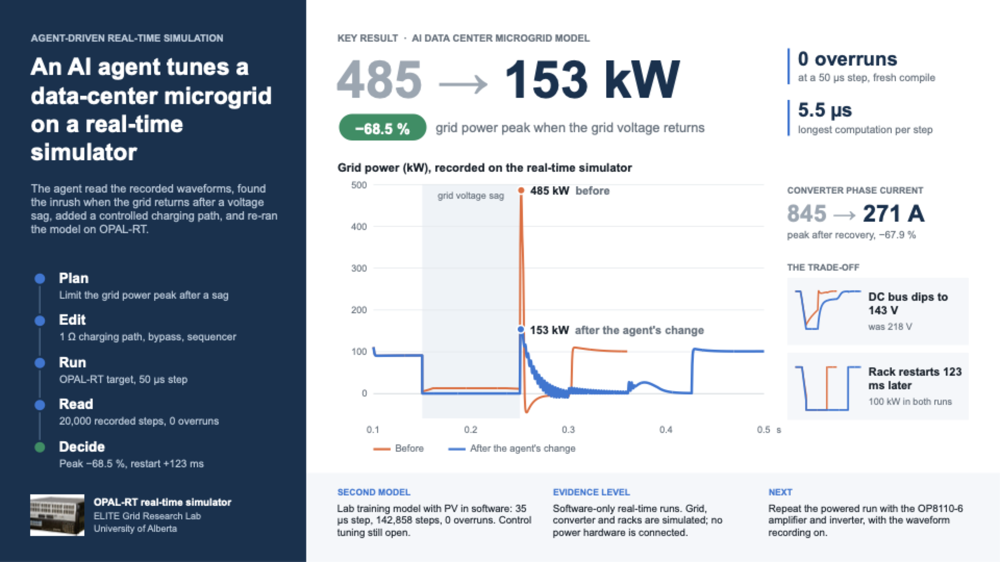

| Step | What happened |
| --- | --- |
| Baseline | The agent ran the original model on the target and recorded it |
| Diagnose | From the recording: a 485 kW grid power spike when the voltage returns, caused by uncontrolled recharge of the DC link |
| Edit | Added a controlled charging path and a start-up sequence for the converter |
| Check | Ran five desktop cases at the same step size before using the target |
| Verify | Fresh compile, real-time run, 20,000 recorded steps × 67 channels |

**Recorded on the real-time target, before and after**

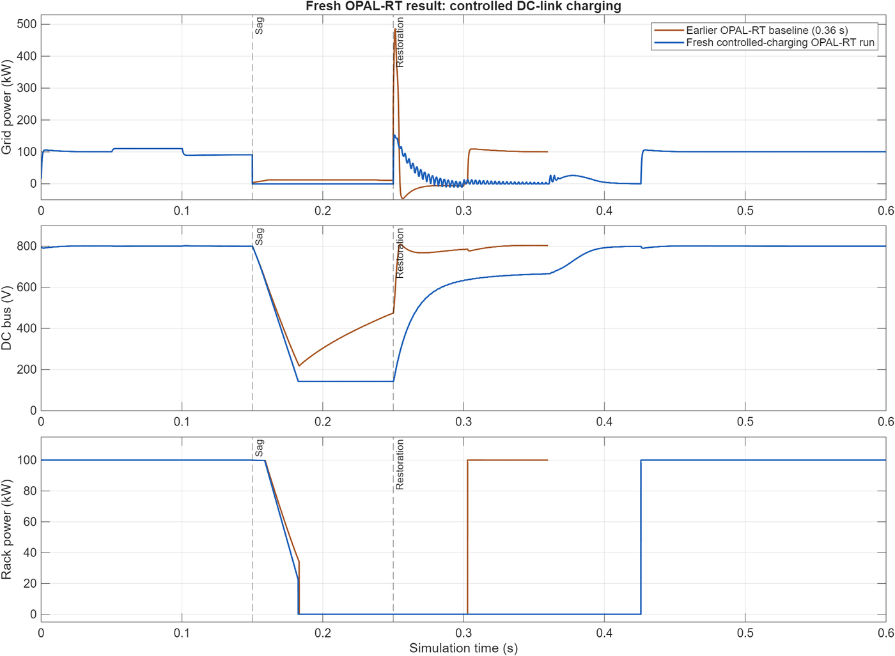

| Quantity | Before | After |
| --- | --- | --- |
| Grid power peak at voltage recovery | 485.5 kW | 153.1 kW (68.5 % lower) |
| Converter phase-current peak | 845 A | 271 A |
| Rack back at full power (100 kW) | 0.303 s | 0.426 s (123 ms later) |
| Minimum DC bus voltage during the sag | 218 V | 143 V |
| Overruns reported by the target | 0 | 0 |
| Longest computation per 50 µs step | — | 5.5 µs |

The agent reported the cost along with the gain: the lower peak is paid for with a later rack restart and a deeper DC bus dip. The real-time recording agrees with the desktop simulation to within 0.04 W.

**The live run**

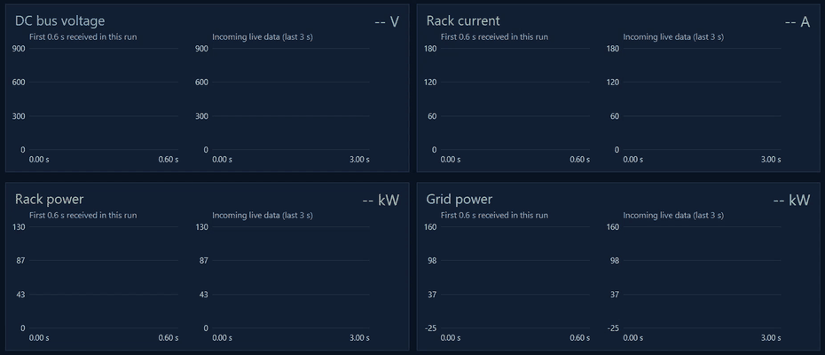

Desktop check before the target run

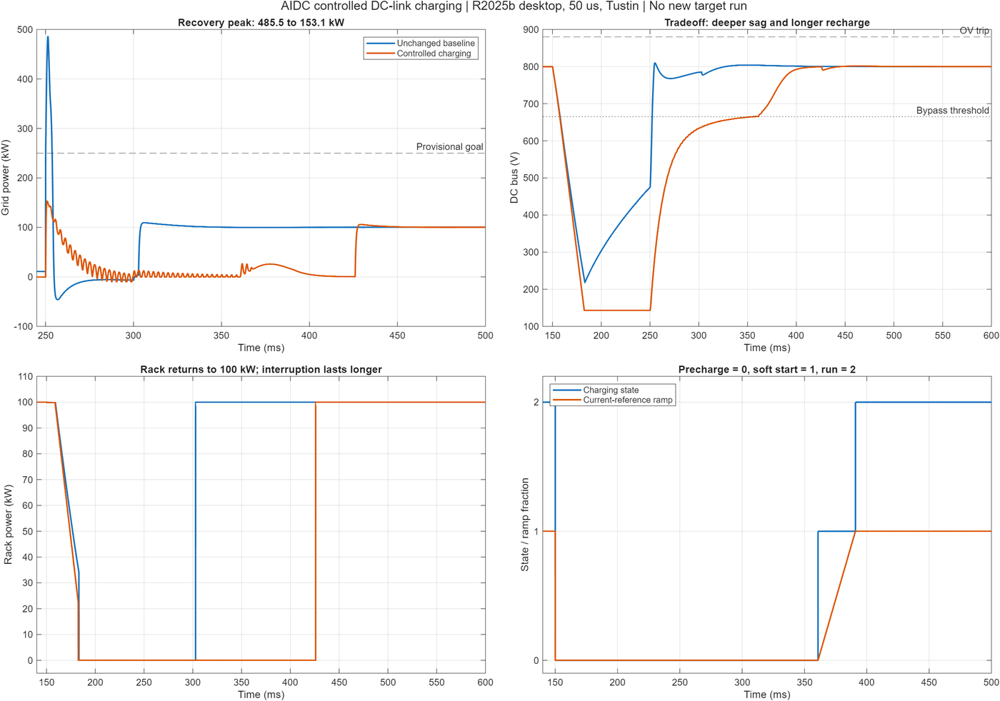

### A second model, and an honest negative result

The agent also revised the lab's OPAL-RT training model so that its PV branch runs in software, and ran it on the target at a 35 µs step: 142,858 consecutive steps over 5 s, 0 reported overruns.

The waveform quality of that model is **not** good yet. The first THD figure looked fine (current 2.3–2.7 %) because it counted only integer harmonics of 60 Hz. Reading the full spectrum showed strong components at 191 Hz and 71.5 Hz, and a current distortion of about 41 %. The PV inverter control still needs tuning. We show this because reading the recording, rather than trusting one summary number, is the point of the method.

| The run on the target | What the full spectrum shows |
| --- | --- |
| 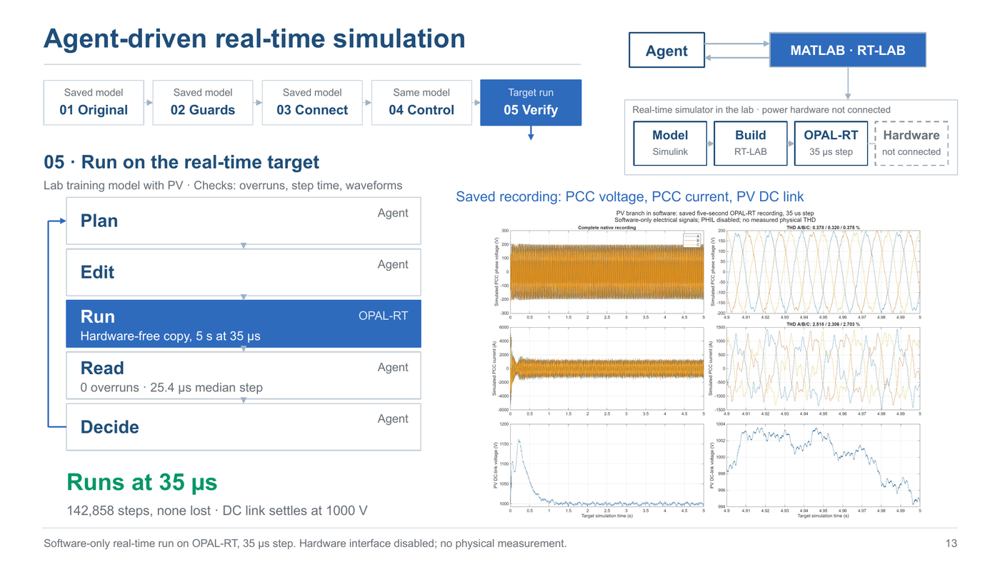 | 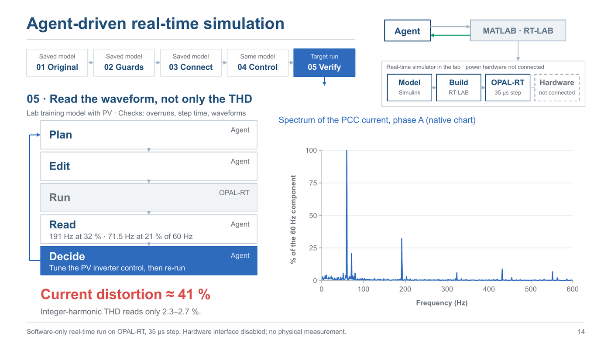 |

### What these runs are, and are not

- They are **software-only real-time runs**. The grid, converter and racks are simulated on the OPAL-RT target. No power hardware was connected for any recorded waveform.
- They are **not** power-hardware-in-the-loop (PHIL) results. Connecting the lab's power amplifier and converters is the next step.
- The overrun count excludes the first ten start-up steps of each run.

---

## The lab behind the demo

The models in case study 2 come from the AI data center microgrid testbed of the ELITE Grid Research Lab. The runs above used the real-time simulator. The remaining equipment is where the same agent loop goes next.

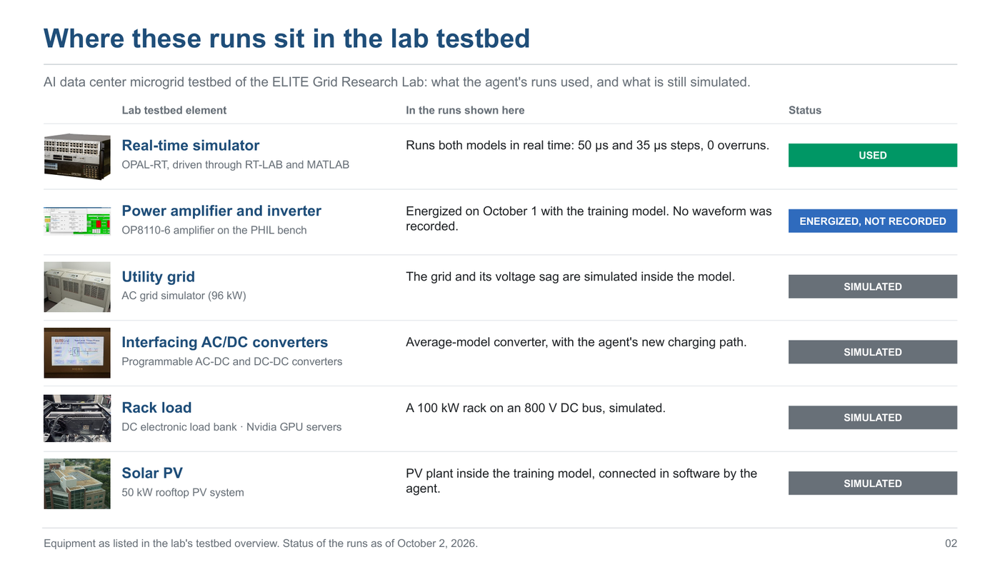

<table>
  <tr>
    <td align="center" width="25%">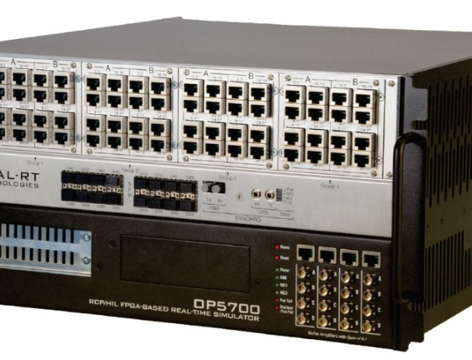 <b>Real-time simulator</b> OPAL-RT · used in the runs above</td>
    <td align="center" width="25%">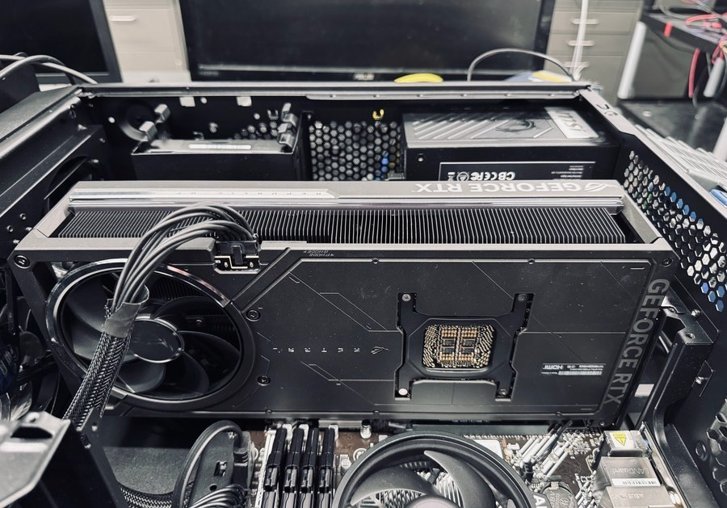 <b>GPU servers</b> Real AI workloads as the load</td>
    <td align="center" width="25%">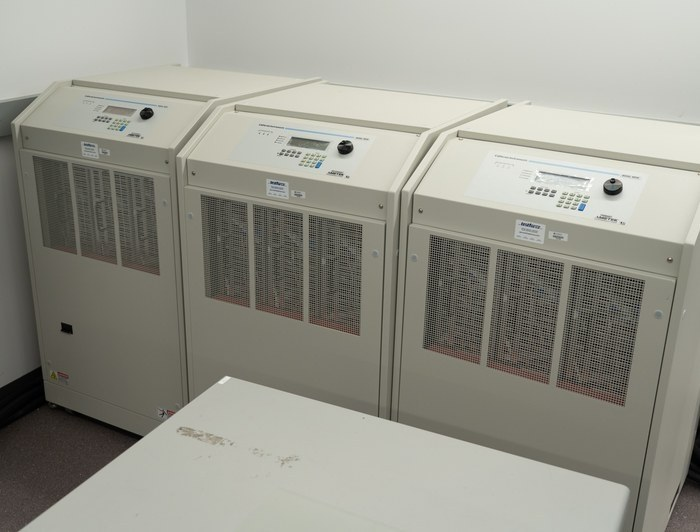 <b>AC grid simulator</b> 96 kW</td>
    <td align="center" width="25%">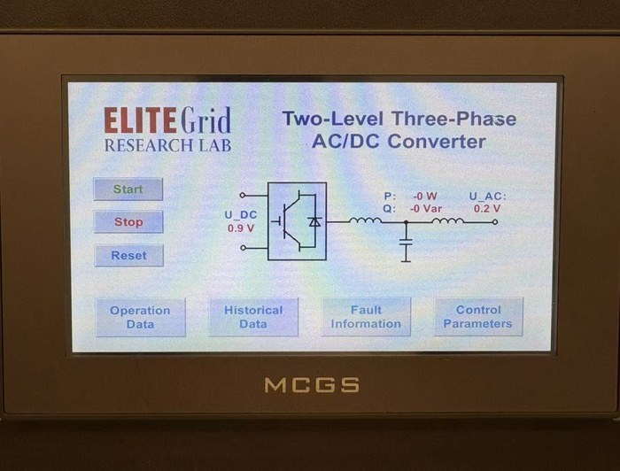 <b>Interfacing converters</b> AC/DC</td>
  </tr>
  <tr>
    <td align="center">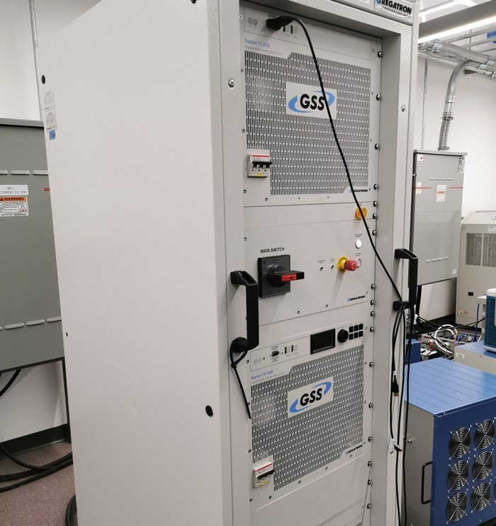 <b>DC grid simulator</b></td>
    <td align="center">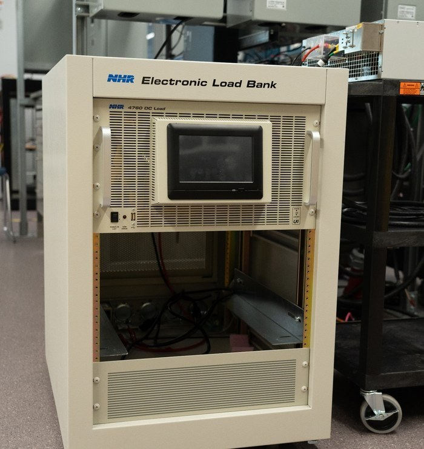 <b>DC load bank</b> Replays rack power profiles</td>
    <td align="center">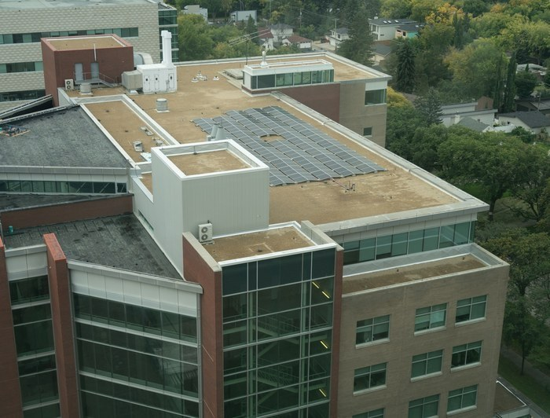 <b>Rooftop PV</b></td>
    <td align="center"></td>
  </tr>
</table>

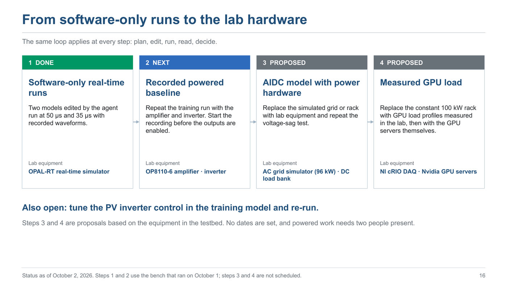

## Behind the demo

The two case studies are the visible part of a longer test campaign. Between August and September 2026 the lab ran 995 agent attempts across 124 tests, 797 of them with the agent operating MATLAB/Simulink: controller tuning, parameter sweeps, building and extending models, and finding and repairing defects planted in models. A run counts as a pass only when an independent check recomputes the result from logged signals.

### What an agent's work looks like over time

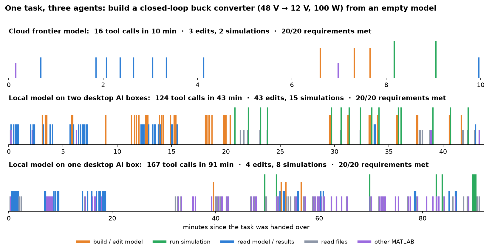

Each tick is one tool call, coloured by what the agent was doing. All three agents were given the same task and the same tools, and all three delivered a model that met every requirement (20 of 20, checked independently). What differs is the path. The cloud model reads first, builds in three edits and confirms with two simulations. The local models reach the same result through many more build, simulate and read cycles. This is the design → simulate → measure → revise loop made visible: the agent's progress is a record of tool calls and measurements that can be replayed and audited, not a block of generated text.

## What is and is not in this repository

Shared here: figures, result numbers and the description of the workflow.

Not shared: the Simulink and RT-LAB models, the controller source, the agent configuration and prompts, the tool-layer implementation, and the test bank. These are part of ongoing research at the lab. If you would like to collaborate or see more, please get in touch.

## Team and contact

Joseph O. Akinwumi, Yuzhuo Li, Pasan Gunawardena, Violet Villeneuve, Bowei Li and Yunwei (Ryan) Li, ELITE Grid Research Lab, Department of Electrical and Computer Engineering, University of Alberta.

Contact: open an issue on this repository, or find us at the Student Project Demonstration in the exhibit hall.

© 2026 ELITE Grid Research Lab, University of Alberta. Figures may be reused with attribution.
